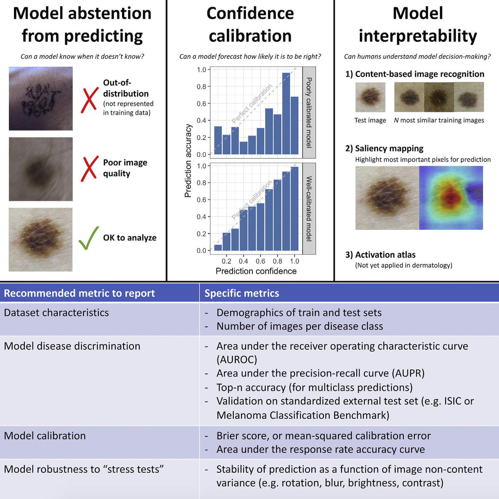
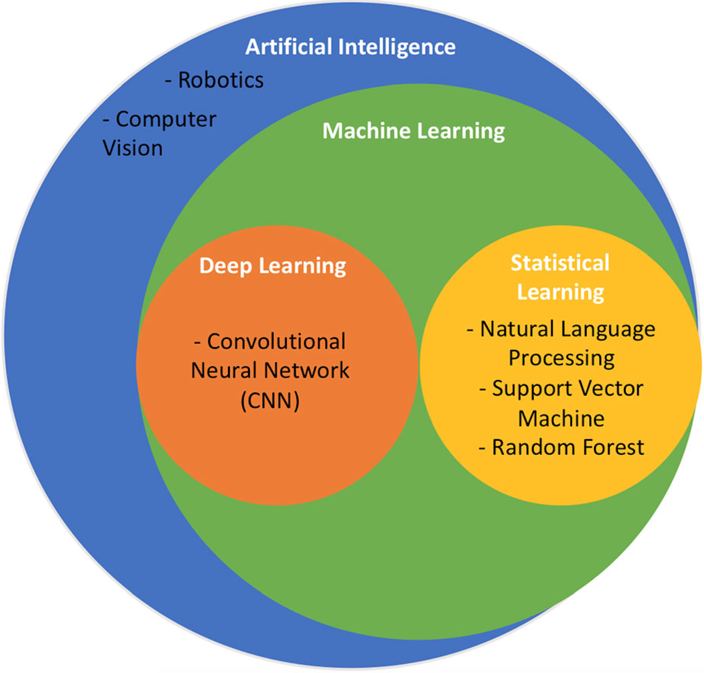
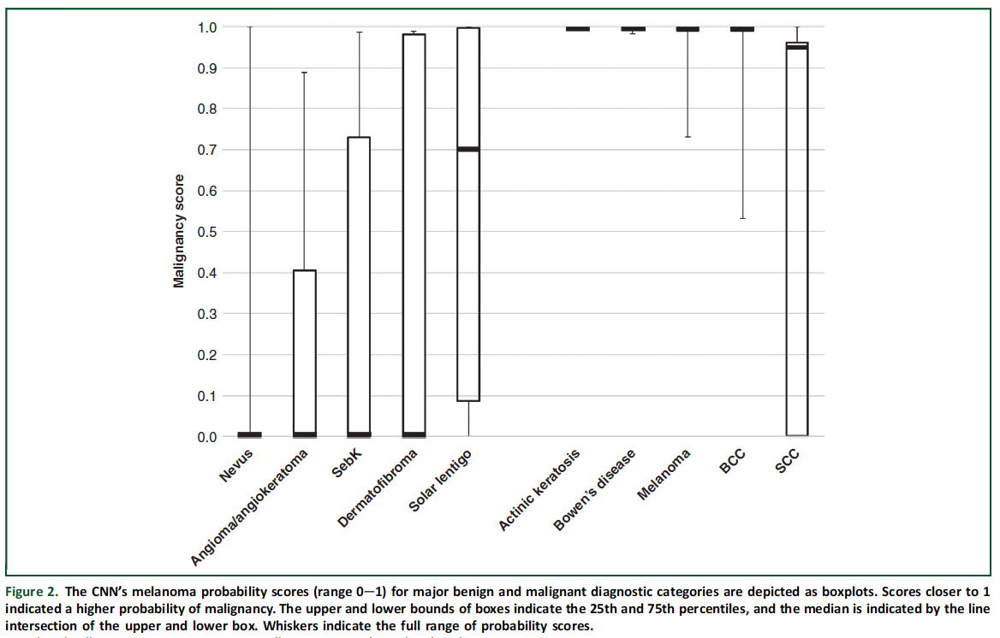
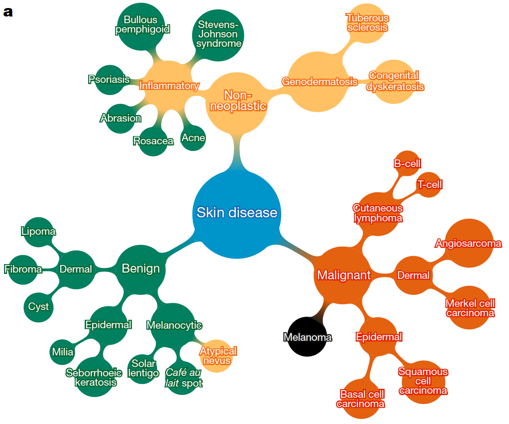
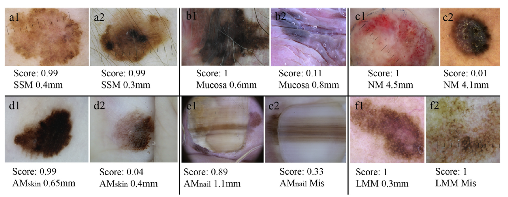

# Literature Review

### Image Quality Assessment of Digital Image Capturing Devices for Melanoma Detection

- By using handheld and/or digital dermoscopy, evaluating and detecting skin cancers such as melanoma can become much easier
- The purpose of this study was to evaluate any color errors in the images due to different lighting conditions or camera settings

- Above, the test setup used in this experiment.
  - Two adjustable LED lights are used for illumination of the chart.
  - The intensity and focus of the lights was controlled on a digital light meter.
- Found that all cameras have some level of error when on the "automatic" setting, but this can be eliminated by adjusting the camera manually or through image post-production
- These steps can greatly increase image quality, and make it much easier to analyze

### Classification of the Clinical Images for Benign and Malignant Cutaneous Tumors Using a Deep Learning Algorithm

- Deep learning was used to classify images of 12 different skin diseases

  - basal cell carcinoma, squamous cell carcinoma, intraepithelial carcinoma, actinic keratosis, seborrheic keratosis, malignant melanoma, melanocytic nevus, lentigo, pyogenic granuloma, hemangioma, dermatofibroma, and wart

- Additional images with greater variation were needed to improve performance and/or accuracy

  

- Any abnormal characteristic(s) of a malignancy were learned and used to classify it

- AI system showed superior capability and performance that the dermatologists in the diagnosis
  
  - Only true for two of the sample datasets
  
- Another method is the use of "binary classification" which was also equal to or better than the abilities of the scientists who were participating in the study

### Dermoscopy Image Analysis: Overview and Future Directions

- Brief overview of image analysis
  - Three main aspects - segmentation, feature extraction, and classification
- Clinical exmainations have limited/unreliable accuracy
  - Makes it difficult to analyze melanoma and/or other skin cancers
- Infrared imaging, multispectral imaging, and confocal microscopy all provide solutions to this problem
- It may be difficult to develop an AI algorithm capable of segementation
- Mainly due to great variety in lesions
  - Shape, size, color, skin type, texture, blood vessels, hair, etc.
- The lack of color standardization has been a large roadblock in the way of progressing DIA (Dermoscopy Image Analysis)
  - There are programs available to normalize the images, but may make them look unnatural
- At first, there were not enough images available to have a sufficient population, but this issue was fixed later on with the publication of over 10,000 new images

### Artificial Intelligence in Dermatology: A Primer

- AI is growing much more popular, since it usually produces results that are more accurate and reliable than those from human dermatologists

- Deep learning can be applied to an artificial neural network to have it "self-learn" a topic

  - Can improve patient care and emphasize visual analysis

- Multiple studies have reported dermatologist-level classification of many different types of images

  

- One major challenge to AI implementation is the wide variety of variables
  - Imaging hardware/software, image quality, zoom, focus, lighting
  - Can alter the precision of the AI's analysis
- It is impossible to compare the performances of multiple deep learning models
  - They are not publicy available
  - One way to solve this would be to have every study use the same benchmark database
- Up to this point, AI has been consistently equal to humans in terms of ability to analyze images
  
  - Will almost certainly become more advanced in the future

### Machine Learning in Dermatology: Current Applications, Opportunities, and Limitations

- The usage of machine learning in the medical field has the potential to gain a human-like intelligence in dermatology
  - Thanks to "large datasets (e.g., electronic medical records and image databases), faster computing, and cheaper data storage"
- Currently, there are five different applications for ML
  - Disease classification with clinical images
  - disease classification with dermapathology images
  - Assessment of skin diseases with personal/mobile applications and devices
  - Large-sclae epidemiology research
  - Precision medicine
    - Machines can perform tasks that most humans cannot
- Still multiple limitations of ML
  - Many variables that need to be accounted for

- Through the use of CNNs, ML can "increase accessibility of skin cancer screenings and streamline the workflow of dermatologists"
- By harnessing this technology, it will become much easier to regulate and optimize technology, as well as benefiting patients

### Man against machine reloaded: performance of a market-approved convolutional neural network in classifying a broad spectrum of skin lesions in comparison with 96 dermatologists working under less artificial conditions

- Studies that are able to effectively compare the abilities of AI to dermatologists are "lacking"
- 100 cases of skin cancers and lesions were used and analyzed
- The results of the CNNs (Convolutional Neural Network) were almost always equal to that of the human researchers
  - Humans may still be the first choice of many studies, but AI will most likely surpass them in the future
- Many manual systems have limitations that can be overcome through the use of CNNs or ML
- Most ML programs are designed to only analyze an individual image, while scientiosts are trained to look at multiple variables
  - E.g. patient’s risk profile, anamnestic data, or lesion evolution

- Image above shows AI's prediction/analysis of each different type of image
  - Dermatologists usually needed more information, as stated above, to make the same predictions

### Dermatologist-level classification of skin cancer with deep neural networks

- Skin cancer is primarily diagnosed visually
  - Can be very tedious and/or unreliable
- By automating this process, identifying cancers such as melanoma can become much easier
- Trained a CNN with thousands of images to recognize over 2,000 different diseases
- By using such a large population, the CNN can achieve similar results as those from a visual examination
- There are maby factors that may benefit or inhibit the programs ability to analyze images
  - Zoom, angle, lighting, etc.
- Deep Learning algorithms have been shown to surpass human capabilities is visual tasks
  - Can be applied to aspects of dermoscopy

- Above, a schematic illustration showing how the different diseases that were analyzed in this study are related\

### Melanoma recognition by a deep learning convolutional neural network - Performance in different melanoma subtypes and localisations

- Aimed to "investigate the diagnostic performance of a CNN" with different groups and subtypes of melanoma
- A market version of a CNN was used on six image sets
  - Each set had 30 malignant and 100 benign lesions
- Malignant melanoma accounts for the highest mortality rates od all skin cancers
  - Analyzing and diagnosing cases can help advance the medical field a lot
- "The increasing application of artificial intelligence and machine learning in areas of healthcare and medicine has attracted a great deal of research interest in recent decades"
- CNNs havce recently proven a dermatologist-level performance and capability in relatively difficult to diagnose cases
- Provides data by comparing sensitivity, specificity, and "receiver operating characteristics-area" of a CNN across all six image sets
  - More images/subtypes = more variation

- Above, the different lesions randomly selected from each of the images sets
- The CNN got the majority of the images correctly analyzed
  - No false negatives
- As expected, the CNN showed the highest performance on the set for which the most images were available
  - Allowed it to "learn" more about that set

