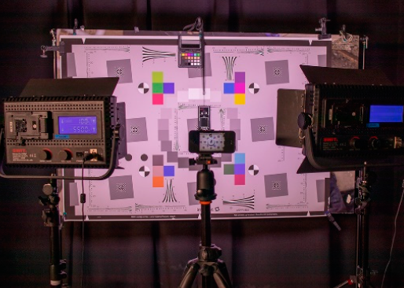
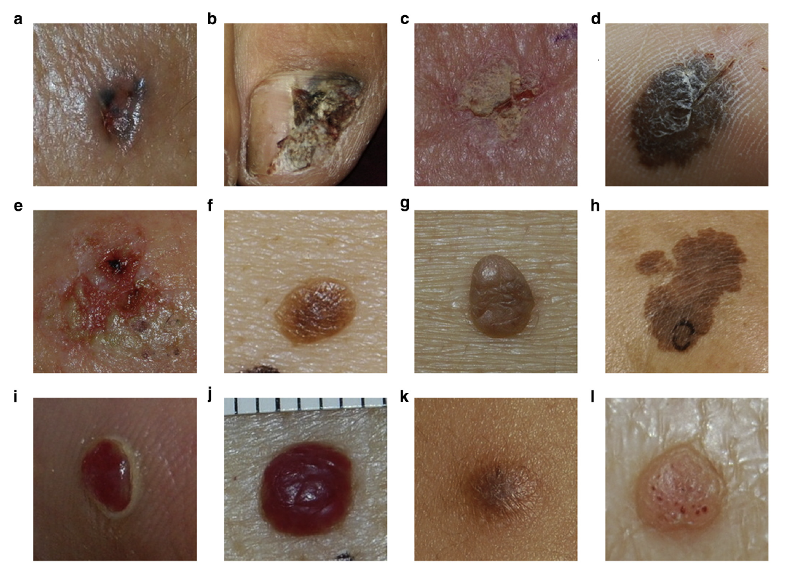

# Literature Review

### Image Quality Assessment of Digital Image Capturing Devices for Melanoma Detection

- By using handheld and/or digital dermoscopy, evaluating and detecting skin cancers such as melanoma can become much easier
- The purpose of this study was to evaluate any color errors in the images due to different lighting conditions or camera settings

- Above, the test setup used in this experiment.
  - Two adjustable LED lights are used for illumination of the chart.
  - The intensity and focus of the lights was controlled on a digital light meter.
- Found that all cameras have some level of error when on the "automatic" setting, but this can be eliminated by adjusting the camera manually or through image post-production
- These steps can greatly increase image quality, and make it much easier to analyze

### Classification of the Clinical Images for Benign and Malignant Cutaneous Tumors Using a Deep Learning Algorithm

- Deep learning was used to classify images of 12 different skin diseases

  - basal cell carcinoma, squamous cell carcinoma, intraepithelial carcinoma, actinic keratosis, seborrheic keratosis, malignant melanoma, melanocytic nevus, lentigo, pyogenic granuloma, hemangioma, dermatofibroma, and wart

- Additional images with greater variation were needed to improve performance and/or accuracy

  

- Any abnormal characteristic(s) of a malignancy were learned and used to classify it

- AI system showed superior capability and performance that the dermatologists in the diagnosis
  
  - Only true for two of the sample datasets
  
- Another method is the use of "binary classification" which was also equal to or better than the abilities of the scientists who were participating in the study

### Dermoscopy Image Analysis: Overview and Future Directions

- Brief overview of image analysis
  - Segmentation, feature extraction, and classification
- Clinical exmainations have limited/unreliable accuracy
  - Makes it difficult to analyze melanoma and/or other skin cancers
- Infrared imaging, multispectral imaging, and confocal microscopy all provide solutions to this problem
- It may be difficult to develop an AI algorithm capable of segementation
- Mainly due to great variety in lesions
  - Shape, size, color, skin type, texture, blood vessels, hair, etc.
- The lack of color standardization has been a large roadblock in the way of progressing DIA (Dermoscopy Image Analysis)
  - There are programs available to normalize the images, but may make them look unnatural
- At first, there were not enough images available to have a sufficient population, but this issue was fixed later on with the publication of over 10,000 new images

### Article 4

# hihihi