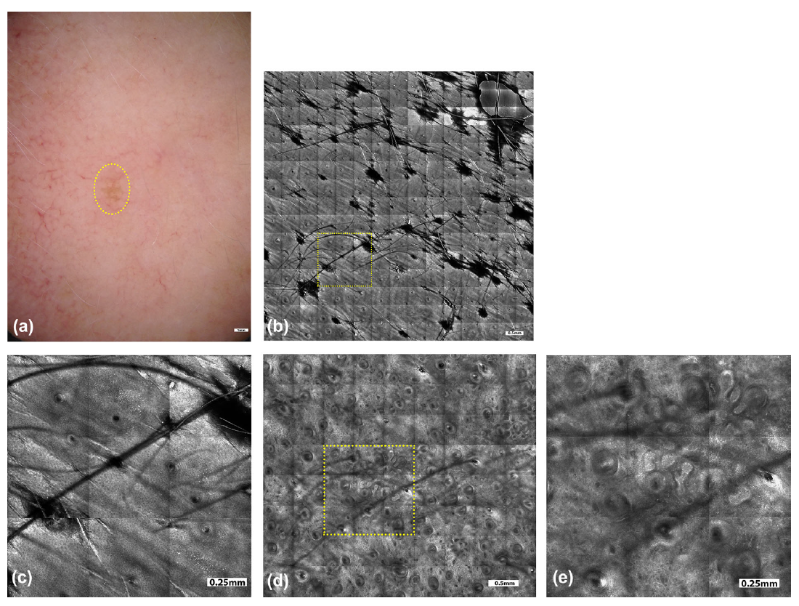

# Literature Review

### Image Quality Assessment of Digital Image Capturing Devices for Melanoma Detection

- By using handheld and/or digital dermoscopy, evaluating and detecting skin cancers such as melanoma can become much easier
- The purpose of this study was to evaluate any color errors in the images due to different lighting conditions or camera settings

- Above, the test setup used in this experiment.
  - Two adjustable LED lights are used for illumination of the chart.
  - The intensity and focus of the lights was controlled on a digital light meter.
- Found that all cameras have some level of error when on the "automatic" setting, but this can be eliminated by adjusting the camera manually or through image post-production
- These steps can greatly increase image quality, and make it much easier to analyze

### Classification of the Clinical Images for Benign and Malignant Cutaneous Tumors Using a Deep Learning Algorithm

- Deep learning was used to classify images of 12 different skin diseases

  - basal cell carcinoma, squamous cell carcinoma, intraepithelial carcinoma, actinic keratosis, seborrheic keratosis, malignant melanoma, melanocytic nevus, lentigo, pyogenic granuloma, hemangioma, dermatofibroma, and wart

- Additional images with greater variation were needed to improve performance and/or accuracy

  

- Any abnormal characteristic(s) of a malignancy were learned and used to classify it

- AI system showed superior capability and performance that the dermatologists in the diagnosis

  - Only true for two of the sample datasets

- Another method is the use of "binary classification" which was also equal to or better than the abilities of the scientists who were participating in the study

### Dermoscopy Image Analysis: Overview and Future Directions

- Brief overview of image analysis
  - Three main aspects - segmentation, feature extraction, and classification
- Clinical exmainations have limited/unreliable accuracy
  - Makes it difficult to analyze melanoma and/or other skin cancers
- Infrared imaging, multispectral imaging, and confocal microscopy all provide solutions to this problem
- It may be difficult to develop an AI algorithm capable of segementation
- Mainly due to great variety in lesions
  - Shape, size, color, skin type, texture, blood vessels, hair, etc.
- The lack of color standardization has been a large roadblock in the way of progressing DIA (Dermoscopy Image Analysis)
  - There are programs available to normalize the images, but may make them look unnatural
- At first, there were not enough images available to have a sufficient population, but this issue was fixed later on with the publication of over 10,000 new images

### Artificial Intelligence in Dermatology: A Primer

- AI is growing much more popular, since it usually produces results that are more accurate and reliable than those from human dermatologists

- Deep learning can be applied to an artificial neural network to have it "self-learn" a topic

  - Can improve patient care and emphasize visual analysis

- Multiple studies have reported dermatologist-level classification of many different types of images

  

- One major challenge to AI implementation is the wide variety of variables

  - Imaging hardware/software, image quality, zoom, focus, lighting
  - Can alter the precision of the AI's analysis

- It is impossible to compare the performances of multiple deep learning models

  - They are not publicy available
  - One way to solve this would be to have every study use the same benchmark database

- Up to this point, AI has been consistently equal to humans in terms of ability to analyze images

  - Will almost certainly become more advanced in the future

### Machine Learning in Dermatology: Current Applications, Opportunities, and Limitations

- The usage of machine learning in the medical field has the potential to gain a human-like intelligence in dermatology
  - Thanks to "large datasets (e.g., electronic medical records and image databases), faster computing, and cheaper data storage"
- Currently, there are five different applications for ML
  - Disease classification with clinical images
  - disease classification with dermapathology images
  - Assessment of skin diseases with personal/mobile applications and devices
  - Large-sclae epidemiology research
  - Precision medicine
    - Machines can perform tasks that most humans cannot
- Still multiple limitations of ML
  - Many variables that need to be accounted for

- Through the use of CNNs, ML can "increase accessibility of skin cancer screenings and streamline the workflow of dermatologists"
- By harnessing this technology, it will become much easier to regulate and optimize technology, as well as benefiting patients

### Man against machine reloaded: performance of a market-approved convolutional neural network in classifying a broad spectrum of skin lesions in comparison with 96 dermatologists working under less artificial conditions

- Studies that are able to effectively compare the abilities of AI to dermatologists are "lacking"
- 100 cases of skin cancers and lesions were used and analyzed
- The results of the CNNs (Convolutional Neural Network) were almost always equal to that of the human researchers
  - Humans may still be the first choice of many studies, but AI will most likely surpass them in the future
- Many manual systems have limitations that can be overcome through the use of CNNs or ML
- Most ML programs are designed to only analyze an individual image, while scientiosts are trained to look at multiple variables
  - E.g. patient’s risk profile, anamnestic data, or lesion evolution

- Image above shows AI's prediction/analysis of each different type of image
  - Dermatologists usually needed more information, as stated above, to make the same predictions

### Dermatologist-level classification of skin cancer with deep neural networks

- Skin cancer is primarily diagnosed visually
  - Can be very tedious and/or unreliable
- By automating this process, identifying cancers such as melanoma can become much easier
- Trained a CNN with thousands of images to recognize over 2,000 different diseases
- By using such a large population, the CNN can achieve similar results as those from a visual examination
- There are maby factors that may benefit or inhibit the programs ability to analyze images
  - Zoom, angle, lighting, etc.
- Deep Learning algorithms have been shown to surpass human capabilities is visual tasks
  - Can be applied to aspects of dermoscopy

- Above, a schematic illustration showing how the different diseases that were analyzed in this study are related\

### Melanoma recognition by a deep learning convolutional neural network - Performance in different melanoma subtypes and localisations

- Aimed to "investigate the diagnostic performance of a CNN" with different groups and subtypes of melanoma
- A market version of a CNN was used on six image sets
  - Each set had 30 malignant and 100 benign lesions
- Malignant melanoma accounts for the highest mortality rates od all skin cancers
  - Analyzing and diagnosing cases can help advance the medical field a lot
- "The increasing application of artificial intelligence and machine learning in areas of healthcare and medicine has attracted a great deal of research interest in recent decades"
- CNNs havce recently proven a dermatologist-level performance and capability in relatively difficult to diagnose cases
- Provides data by comparing sensitivity, specificity, and "receiver operating characteristics-area" of a CNN across all six image sets
  - More images/subtypes = more variation

- Above, the different lesions randomly selected from each of the images sets
- The CNN got the majority of the images correctly analyzed
  - No false negatives
- As expected, the CNN showed the highest performance on the set for which the most images were available
  - Allowed it to "learn" more about that set

### Deep Learning for Dermatologists: Part II. Current Applications

- Due to an increase in larger datasets, more advanced computer hardware, and other advancements, AI "has recently contrbuted to dramatic progress in medicine"
- Part 1 of this article offered an introduction to deep learning, as well as how it can be used/applied
- Augmented Intelligence (AuI) is an alterantive term for AI to describe how computers can assist and improve upon human decision making
- "Deep learning’s potential to enhance the practice of dermatology has been widely discussed with applications ranging from image classification to discovering novel risk factors for non-melanoma skin cancers"
- The majority of advances in eramtology have used an algorithm known as a Neural Network (NN), which can take input data and process it into an output prediciton
  - For instance, diagnosing a skin disease from a clinical photo, or highlighting regions in a pathology slide that may contain tumors
- The predictions that NN's make can be evaluated for performance/accuracy
  - The algorithm can then be improved upon using that information
- This cycle is repeated until the NN is accurate enough to be used for more genral use
- Some applications of AI for the future are:
  - Classification and Differentation
    - Classifying images of pigmented and non-pigmented skin
    - Identifying epidermal and melnocytic lesions
    - Distiguinsuing squamous cell carcinomas
  - Dermatopathology
    - Identifying mitotic cells within detected tumor regions (Diagnostic accuracy of 83% was reported)
    - Identifying areas of a slide with the highest density of mitotic figures
    - "Reduce the need for... immunohistochemical stains for mitosis"

### A deep learning system for differential diagnosis of skin diseases

- Because of a global shortage of dermatologists, many skin exmainations have to be performed by doctors whose results may not be accurate and/or reliable
  - The usage of ML and AI in dermatology can make diagnoses much easier and more reliable

- This study used 16, 114 clinical images, and trained a DLS (Deep Learning System) to distinguish between 26 common skin conditions
- The DLS was able to match the humans, having results that were "non-inferior to six other dermatologists and superior to six primary care physicians and six nurse practitioners"
- To add to the shortage of dermatoligts, the price of a consultation is consoistently rising
  - Allowing people to diagnose a skin condition with a computer without having to go to the doctor would make this process much easier
- While results have varoed depending on the conditions of the experiment, the majorioty of studies reported that the DLS had capabilites equal to, or superior than that of the dermatologists

- Above, the process that the researchers used to train and valifdate the DLS
  - Allowed it to read an image, and figure out what skin condition it displayed through a series of set criteria

### Skin lesion classification using ensembles of multi-resolution EfficientNets with meta data 

- Images with different resolutions can pose an issue since the computer has to be able to read them, no matter the size, resolution, angle, lighting, etc.
- In order to have the largest variation and highest accuracy, more images can be used to increase reliability
- The dataset where the images were taken from also had information regarding the patients' age, anatomical site, and sex
  - This can be used to visualize any connections or relationships between skin diseases, nd one of these criteria

- The researchers developed the program to detect the relevant area of the image, and rcrop out the background, which is not needed for analysis
  - This allows the computer to focus on a smaller area, but a more relevant one
- The program also automatically resized the images while maintaining the aspect ratio
- Task 2 was to use the meta data with a NN to try and connect any results with age, gender, or anatomical site
- The CNN used in the experiment heavily relied on EfficientNets to structure the results
  - Can compare different strategies and decide which is the most reliable/accurate

### Skin Lesion Segmentation with Improved Convolutional Neural Network

- Skin cancer has become much more comman in recent years, and the medical industry has had to adapt as a result
- By using a fully convolutional network (FCN), there is no need for pre or post processing of skin images
  - Enables more precison detection and analysis of images
- "Since melanoma is known to be the most lethal skin cancer," its recent increase in cases has become a cause for concern
- The conventional method for diagnosing such diseases is a visual examination
  - Can be slow, tedious, and/or inaccurate
- Computers are able to make the same subjective decisions without the many years of training that dermatologists go through
- The FCN structure "is not affected by disturbing factors such as hair, ruler markers, indistinct boundaries, and illumination problems"
  - Makes it completely compatible with almost any image
- Though many of these issues can be solves just as easily using pre-processing programs, that methodology creates a heavy workload for the computer

- Above, some issues that may be found in dermoscopic images
  - Hair, markers, different zoom/angle/lighting, color, etc.
- The FCN is able to recognize and ignore these issues, and be able to analuyze just the lesion that the image is focusing on

### Augmented Intelligence Dermatology: Deep Neural Networks Empower Medical Professionals in Diagnosing Skin Cancer and Predicting Treatment Options for 134 Skin Disorders

- Previous efforts of DL algorithms in dermatology have only covered a small range of skin diseases/disorders

  - Despite this, they were very precise (for the most part)

- Using 220,680 different images from multiple online datasets, this AI program is able to recognize and diagnose at least 134 skin disorders

  - The images spanned 174 diseases, however, some were unable to be learned by the DL algorithm

- While CNN's have recently been very successful in specific tasks, this DL program is able to do a variety of tasks

  - "The algorithm could accurately predict malignancy, suggest primary treatment options, render multi-class classification... and improve the performance of medical professionals"

- This study usied CNN architecture, but modified it to their preferences/requierments

- Using two different datasets, the algorithm was able to achieve results that simulated a real clinical practice, "where clinicians are required to differentiate malignancy from several types of other skin diseases"

- The performance and accuracy of the model was compared to 47 medical professionals made up of 21 board-certified dermatologists and 26 dermatology residents, using a random selection of the images used in creating the algorithm

  - "The algorithm showed the similar performance as that of the dermatology residents but slightly lower than those of the [certified] dermatologists"

### Reflectance Confocal Microscopy of Skin In Vivo: From Bench to Bedside

- "Reflectance confocal microscopy (RCM) imaging of skin was granted codes for reimbursement by the US Centers for Medicare and Medicaid Services"
  - Can be combined with dermoscopic examination(s) to analyze images, and determine whether a further examination such as a biopsy is required
- RCM's sucess also allows future ideas similar to this become more popular, usable, and efficient
- Early detection of many skin cancers can be very difficult if the diagnosis is reliant solely on a visual examination
  - Can be affected by human error, unlike computers/AI
- Many dermatologists prefer to rather be "safe than sorry," resulting in millions of unnecessary biopsies every year
  - Using a much more efficient and accurate RCM program reduces the possibility and/or capacity for human error, and creates results that are much more reliable
- Can also greatly reduce the cost of an examination, since many "can be performed directly on the patient, in real-time, at the bedside, and likely at reduced (or at least justifiable) cost"
- Sample of 100 lesions had an average specificity of 79%
  - Other studies reported evidence with an average accuracy of up to 84%

- Above, an example of a case in which the RCM was able to correclty analuyze and diagnose the lesion, which was on the patient's cheek
  - It had been present and unchanged for over a year, and would have remained unnoticed had a visul examination been used instead

### Results of the 2016 International Skin Imaging Collaboration *ISBI Challenge*: Comparison of the accuracy of computer algorithms to dermatologists for the diagnosis of melanoma from dermoscopic images

- Used a cross-sectional study of 100 randomly selected dermoscopic images, and compared the results of a computer algorthms to those of a human dermatologist
- Unfortunately, "The dataset lacked the full spectrum of skin lesions encountered in clinical practice, particularly banal lesions"
  - Can impact the study later if the researchers want to increase the number of diseases that the program can recognize
- As with the majority of the other studies, "Deep learning computer vision systems classified melanoma dermoscopy images with accuracy that exceeded some but not all dermatologists"
- Early diagnosis of skin cancer, particulary melanoma is still very challenging, due to how tedious it can be
- While using computers to automatically analyze images may not be a perfect solution, it can improve upon a process that is going to continue advancing in the future anyway
- Implementng one of the systems cxan not only make the idagnosis much easier, it can also take a load off of the dermatologists who would have had to perform a visual examination otherwise
  - The ideal program is one which anyone is able to use on their own, without the need to come to a medical clinic

